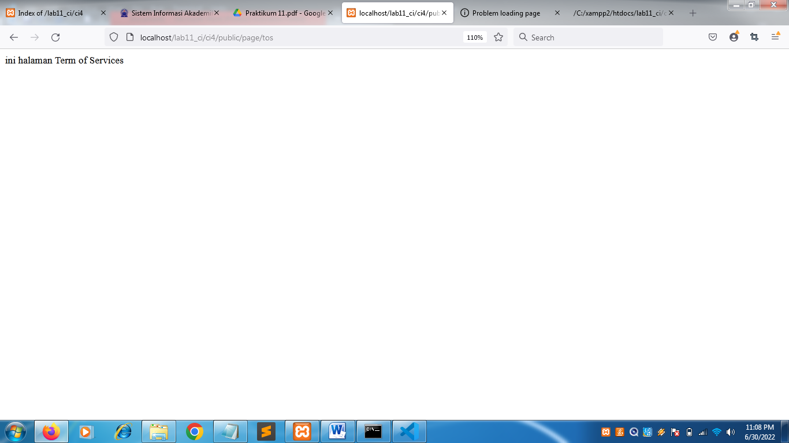

| Nama      | Nuryadi |
| ----------- | ----------- |
| NIM     | 312010621       |
| Kelas   | TI.20.A.1        |

## Langkah langkah praktikum 11

Berikut beberapa ekstensi yang perlu diaktifkan:

• php-json ekstension untuk bekerja dengan JSON;

• php-mysqlnd native driver untuk MySQL;

• php-xml ekstension untuk bekerja dengan XML;

• php-intl ekstensi untuk membuat aplikasi multibahasa;

• libcurl (opsional), jika ingin pakai Curl.

Untuk mengaktifkan ekstentsi tersebut, melalu XAMPP Control Panel, pada bagian
Apache klik Config -> PHP.ini

Pada bagian extention, hilangkan tanda ; (titik koma) pada ekstensi yang akan
diaktifkan. Kemudian simpan kembali filenya dan restart Apache web server.

• Unduh Codeigniter dari website https://codeigniter.com/download

• Extrak file zip Codeigniter ke direktori htdocs/lab11_ci.

• Ubah nama direktory framework-4.x.xx menjadi ci4.

• Buka browser dengan alamat http://localhost/lab11_ci/ci4/public/

## Menjalankan CLI (Command Line Interface)
Codeigniter 4 menyediakan CLI untuk mempermudah proses development. Untuk
mengakses CLI buka terminal/command prompt.

Perintah yang dapat dijalankan untuk memanggil CLI Codeigniter adalah:

php spark

## Mengaktifkan Mode Debugging

Codeigniter 4 menyediakan fitur debugging untuk memudahkan developer untuk
mengetahui pesan error apabila terjadi kesalahan dalam membuat kode program.
Secara default fitur ini belum aktif. Ketika terjadi error pada aplikasi akan ditampilkan
pesan kesalahan seperti berikut.

Semua jenis error akan ditampilkan sama. Untuk memudahkan mengetahui jenis errornya, maka perlu diaktifkan mode debugging dengan mengubah nilai konfigurasi pada environment variable CI_ENVIRONMENT menjadi development

Ubah nama file env menjadi .env kemudian buka file tersebut dan ubah nilai variable
CI_ENVIRINMENT menjadi development.

Gambar  di atas merupakan contoh error yang terjadi. Untuk mencoba error tersebut, ubah kode pada file app/Controller/home.php

## Struktur Direktori

Untuk lebih memahami Framework Codeigniter 4 perlu mengetahui struktur direktori
dan file yang ada. Buka pada Windows Explorer atau dari Visual Studio Code ->
Open Folder.
Terdapat beberapa direktori dan file yang perlu dipahami fungsi dan kegunaannya.

• .github folder ini kita butuhkan untuk konfigurasi repo github, seperti konfigurasi
untuk build dengan github action;

• app folder ini akan berisi kode dari aplikasi yang kita kembangkan;

• public folder ini berisi file yang bisa diakses oleh publik, seperti file index.php,
robots.txt, favicon.ico, ads.txt, dll;

• tests folder ini berisi kode untuk melakukan testing dengna PHPunit;
vendor folder ini berisi library yang dibutuhkan oleh aplikasi, isinya juga termasuk
kode core dari system CI.

• writable folder ini berisi file yang ditulis oleh aplikasi. Nantinya, kita bisa pakai
untuk menyimpan file yang di-upload, logs, session, dll.
Sedangkan file-file yang berada pada root direktori CI sebagai berikut.

• .env adalah file yang berisi variabel environment yang dibutuhkan oleh aplikasi.

• .gitignore adalah file yang berisi daftar nama file dan folder yang akan diabaikan
oleh Git.

• build adalah script untuk mengubah versi codeigniter yang digunakan. Ada versi
release (stabil) dan development (labil).

• composer.json adalah file JSON yang berisi informasi tentang proyek dan daftar
library yang dibutuhkannya. File ini digunakan oleh Composer sebagai acuan.

• composer.lock adalah file yang berisi informasi versi dari libraray yang digunakan
aplikasi.

• license.txt adalah file yang berisi penjelasan tentang lisensi Codeigniter;

• phpunit.xml.dist adalah file XML yang berisi konfigurasi untuk PHPunit.

• README.md adalah file keterangan tentang codebase CI. Ini biasanya akan
dibutuhkan pada repo github atau gitlab.

• spark adalah program atau script yang berfungsi untuk menjalankan server,
generate kode, dll.

Fokus kita pada folder app, dimana folder tersebut adalah area kerja kita untuk
membuat aplikasi. Dan folder public untuk menyimpan aset web seperti css, gambar,
javascript, dll.
Memahami Konsep MVC
Codeigniter menggunakan konsep MVC. MVC meripakan singkatan dari
Model-View-Controller. MVC merupakan konsep arsitektur yang umum digunakan
dalam pengembangan aplikasi. Konsep MVC adalah memisahkan kode program
berdasarkan logic proses, data, dan tampilan. Untuk logic proses diletakkan pada
direktori Contoller, Objek data diletakkan pada direktori Model, dan desain tampilan
diletakkan pada direktori View.
Codeigniter menggunakan konsep pemrograman berorientasi objek dalam
mengimplementasikan konsep MVC.
Model merupakan kode program yang berisi pemodelan data. Data dapat berupa
database ataupun sumber lainnya.
View merupakan kode program yang berisi bagian yang menangani terkait tampilan
user interface sebuah aplikasi. didalam aplikasi web biasanya pasti akan berhubungan
dengan html dan css.
Controller merupakaan kode program yang berkaitan dengan logic proses yang
menghubungkan antara view dan model. Controller berfungsi untuk menerima request
dan data dari user kemudian diproses dengan menghubungkan bagian model dan view.
Routing dan Controller
Routing merupakan proses yang mengatur arah atau rute dari request untuk menentukan
fungsi/bagian mana yang akan memproses request tersebut. Pada framework CI4,
routing bertujuan untuk menentukan Controller mana yang harus merespon sebuah
request. Controller adalah class atau script yang bertanggung jawab merespon sebuah
request.
Pada Codeigniter, request yang diterima oleh file index.php akan diarahkan ke Router
untuk meudian oleh router tesebut diarahkan ke Controller.
Router terletak pada file app/config/Routes.php

Pada file tersebut kita dapat mendefinisikan route untuk aplikasi yang kita buat.
Contoh :

|$routes->get('/', 'Home::index');|

Kode tersebut akan mengarahkan rute untuk halaman home.

## Membuat Route Baru.

Tambahkan kode berikut di dalam Routes.php

Untuk mengetahui route yang ditambahkan sudah benar, buka CLI dan jalankan
perintah berikut

Selanjutnya coba akses route yang telah dibuat dengan mengakses alamat url
http://localhost:8080/about

Ketika diakses akan mucul tampilan error 404 file not found, itu artinya file/page
tersebut tidak ada. Untuk dapat mengakses halaman tersebut, harus dibuat terlebih
dahulu Contoller yang sesuai dengan routing yang dibuat yaitu Contoller Page.
Membuat Controller
Selanjutnya adalah membuat Controller Page. Buat file baru dengan nama page.php
pada direktori Controller kemudian isi kodenya seperti berikut.

Selanjutnya refresh Kembali browser, maka akan ditampilkan hasilnya yaotu halaman
sudah dapat diakses.

## Auto Routing
Secara default fitur autoroute pada Codeiginiter sudah aktif. Untuk mengubah status
autoroute dapat mengubah nilai variabelnya. Untuk menonaktifkan ubah nilai true
menjadi false.
|$routes->setAutoRoute(true);|
Tambahkan method baru pada Controller Page seperti berikut.

Method ini belum ada pada routing, sehingga cara mengaksesnya dengan menggunakan
alamat: http://localhost:8080/page/tos

## Membuat View

Selanjutnya adalam membuat view untuk tampilan web agar lebih menarik. Buat file
baru dengan nama about.php pada direktori view (app/view/about.php) kemudian isi
kodenya seperti berikut.

Ubah method about pada class Controller Page menjadi seperti berikut:

Kemudian lakukan refresh pada halaman tersebut.

## Membuat Layout Web dengan CSS

Pada dasarnya layout web dengan css dapat diimplamentasikan dengan mudah pada
codeigniter. Yang perlu diketahui adalah, pada Codeigniter 4 file yang menyimpan asset
css dan javascript terletak pada direktori public.
Buat file css pada direktori public dengan nama style.css (copy file dari praktikum
lab4_layout. Kita akan gunakan layout yang pernah dibuat pada praktikum 4.

Kemudian buat folder template pada direktori view kemudian buat file header.php dan
footer.php
File app/view/template/header.php

File app/view/template/footer.php

Kemudian ubah file app/view/about.php seperti berikut.

Selanjutnya refresh tampilan pada alamat http://localhost:8080/about
Selanjutnya refresh browser untuk melihat hasilnya

## PRAKTIKUM 12 ##

Langkah-langkah Praktikum 12

Persiapan.

Untuk memulai membuat aplikasi CRUD sederhana, yang perlu disiapkan adalah

database server menggunakan MySQL. Pastikan MySQL Server sudah dapat dijalankan

melalui XAMPP.

Membuat database

# Membuat Tabel

# struktur tabel

# Konfigurasi koneksi database

Selanjutnya membuat konfigurasi untuk menghubungkan dengan database server.

Konfigurasi dapat dilakukan dengan du acara, yaitu pada file app/config/database.php

atau menggunakan file .env. Pada praktikum ini kita gunakan konfigurasi pada file .env.

# Membuat Model

Selanjutnya adalah membuat Model untuk memproses data Artikel. Buat file baru pada

direktori app/Models dengan nama ArtikelModel.php

# Membuat Controller

Buat Controller baru dengan nama Artikel.php pada direktori app/Controllers.

# Membuat View

Buat direktori baru dengan nama artikel pada direktori app/views, kemudian buat file

baru dengan nama index.php.

 Selanjutnya buka browser kembali, dengan mengakses url http://localhost:8080/artikel

# Belum ada data yang diampilkan. Kemudian coba tambahkan beberapa data pada database agar dapat ditampilkan datanya.

Menambahkan data

Refresh kembali browser, sehingga akan ditampilkan hasilnya.

# Membuat Tampilan Detail Artikel

Tampilan pada saat judul berita di klik maka akan diarahkan ke halaman yang berbeda.

Tambahkan fungsi baru pada Controller Artikel dengan nama view().

# Membuat View Detail

Buat view baru untuk halaman detail dengan nama app/views/artikel/detail.php.

# Membuat Routing untuk artikel detail

Buka Kembali file app/config/Routes.php, kemudian tambahkan routing untuk artikel detail.

selanjutnya refresh dan lihat hasilnya

# Membuat Menu Admin

Menu admin adalah untuk proses CRUD data artikel. Buat method baru pada

Controller Artikel dengan nama admin_index().

# Selanjutnya buat view untuk tampilan admin dengan nama admin_index.php

# Tambahkan routing untuk menu admin seperti berikut:

Akses menu admin dengan url http://localhost:8080/admin/artikel

# Menambah Data Artikel

Tambahkan fungsi/method baru pada Controller Artikel dengan nama add().

Kemudian buat view untuk form tambah dengan nama form_add.php

# Kemudian buat view untuk form tambah dengan nama form_add.php

Selanjutnya jalankan pada browser

# Kemudian buat view untuk form tambah dengan nama form_edit.php

# Kemudian buat view untuk form tambah dengan nama form_edit.php

Kemudian lihat hasilnya pada beowser

# Menghapus Data

Tambahkan fungsi/method baru pada Controller Artikel dengan nama delete().

## PRAKTIKUM 13 ##

# Langkah-langkah Praktikum 13
Persiapan.

Untuk memulai membuat modul Login, yang perlu disiapkan adalah database server

menggunakan MySQL. Pastikan MySQL Server sudah dapat dijalankan melalui XAMPP.

Membuat Tabel: User Login

# Membuat Model User

Selanjutnya adalah membuat Model untuk memproses data Login. Buat file baru pada
direktori app/Models dengan nama UserModel.php

# Membuat Controller User

Buat Controller baru dengan nama User.php pada direktori app/Controllers.
Kemudian tambahkan method index() untuk menampilkan daftar user, dan method
login() untuk proses login.

# Membuat View Login

Buat direktori baru dengan nama user pada direktori app/views, kemudian buat file
baru dengan nama login.php

#Membuat Database Seeder

Database seeder digunakan untuk membuat data dummy. Untuk keperluan ujicoba modul
login, kita perlu memasukkan data user dan password kedaalam database. Untuk itu buat
database seeder untuk tabel user. Buka CLI, kemudian tulis perintah berikut:

php spark make:seeder UserSeeder

Selanjutnya, buka file UserSeeder.php yang berada di lokasi direktori
/app/Database/Seeds/UserSeeder.php kemudian isi dengan kode berikut:

Selanjutnya buka kembali CLI dan ketik perintah berikut:
php spark db:seed UserSeeder

# Uji Coba Login
Selanjutnya buka url http://localhost:8080/user/login seperti berikut:

#Menambahkan Auth Filter

Selanjutnya membuat filer untuk halaman admin. Buat file baru dengan nama Auth.php
pada direktori app/Filters.

Selanjutnya buka file app/Config/Filters.php tambahkan kode berikut:

'auth' => App\Filters\Auth::class

# Percobaan Akses Menu Admin

Buka url dengan alamat http://localhost:8080/admin/artikel ketika alamat tersebut
diakses maka, akan dimuculkan halaman login.

# Fungsi Logout

Tambahkan method logout pada Controller User seperti berikut:

# PRAKTIKUM 14 #

# Membuat Pagination
Pagination merupakan proses yang digunakan untuk membatasi tampilan yang panjang
dari data yang banyak pada sebuah website. Fungsi pagination adalah memecah
tampilan menjadi beberapa halaman tergantung banyaknya data yang akan ditampilkan
pada setiap halaman.
Pada Codeigniter 4, fungsi pagination sudah tersedia pada Library sehingga cukup
mudah menggunakannya.
Untuk membuat pagination, buka Kembali Controller Artikel, kemudian modifikasi
kode pada method admin_index seperti berikut.

Selanjutnya buka kembali menu daftar artikel tambahkan data lagi untuk melihat hasilnya

# Membuat Pencarian
Pencarian data digunakan untuk memfilter data.
Untuk membuat pencarian data, buka kembali Controller Artikel, pada method
admin_index ubah kodenya seperti berikut

# Upload Gambar
Menambahkan fungsi unggah gambar pada tambah artikel. Buka kembali Controller
Artikel, sesuaikan kode pada method add seperti berikut:

Kemudian pada file views/artikel/form_add.php tambahkan field input file seperti
berikut.

<input type="file" name="gambar">

Dan sesuaikan tag form dengan menambahkan ecrypt type seperti berikut.
<form action="" method="post" enctype="multipart/form-data">

Ujicoba file upload dengan mengakses menu tambah artikel.

Isi data pada form di atas dan lihat hasilnya pada browser

refresh pada browser

